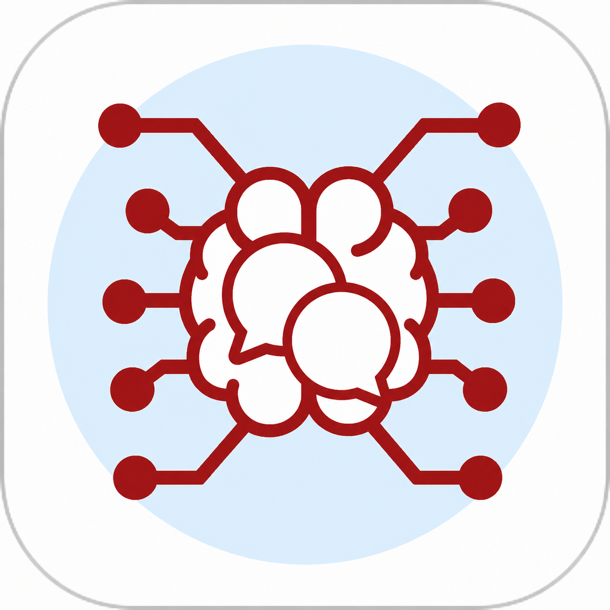

<p align="center"><a href="README.md">简体中文</a> · <strong>繁體中文</strong> · <a href="README_EN.md">English</a> · <a href="README_JA.md">日本語</a></p>

<p align="center">
  
</p>

<h1 align="center">澄語 KiraChat</h1>

<p align="center"><strong>把 SillyTavern 角色卡、多模型 API、本地模型和群聊帶到原生 Android / iOS 客戶端。</strong></p>

<p align="center">
  <a href="https://github.com/liangbannianikun-cmd/kirachat/releases/tag/v0.9.0"></a>
  
  
  
</p>

<p align="center">
  <a href="https://github.com/liangbannianikun-cmd/kirachat/releases/download/v0.9.0/KiraChat-0.9.0-android-debug.apk"><strong>下載 Android APK</strong></a>
  ·
  <a href="https://github.com/liangbannianikun-cmd/kirachat/releases/download/v0.9.0/KiraChat-0.9.0-ios-unsigned.ipa"><strong>下載 iOS IPA</strong></a>
  ·
  <a href="https://github.com/liangbannianikun-cmd/kirachat/releases/tag/v0.9.0">版本與校驗檔案</a>
</p>

KiraChat（澄語）不是 WebView 套殼：Android 使用原生 View，iOS 使用 SwiftUI，針對觸屏重新設計了微信式訊息、角色資料、世界書、群聊、語音與連線流程。

## 它解決什麼問題

| 常見問題 | KiraChat 的處理方式 |
| --- | --- |
| 手機上的網頁角色聊天介面操作擁擠 | 原生 Android/iOS 介面，微信式訊息結構與移動端手勢 |
| 角色卡、模型和介面散落在不同工具裡 | 匯入 SillyTavern V1/V2/V3 JSON、PNG `chara`/`ccv3`，統一連線 GPT、Claude、Gemini 等介面 |
| 想在手機本地聊天，不希望上傳訊息 | Android 可下載執行 Qwen3.5-0.8B/2B，並支援本地圖片理解 |
| 普通聊天應用沒有多角色協作 | 本地建立群聊、`@角色`、關聯性發言、並行生成和組合頭像 |
| 換裝置后角色與聊天難遷移 | 本地備份/還原，或透過自部署伺服器進行客戶端加密同步 |

## 立即安裝

| 平臺 | 下載 | 安裝說明 |
| --- | --- | --- |
| Android 8.0+ | **[下載 APK](https://github.com/liangbannianikun-cmd/kirachat/releases/download/v0.9.0/KiraChat-0.9.0-android-debug.apk)** | 當前為除錯簽名測試包；允許安裝未知來源應用後開啟 APK |
| iOS 16+ | **[下載未簽名 IPA](https://github.com/liangbannianikun-cmd/kirachat/releases/download/v0.9.0/KiraChat-0.9.0-ios-unsigned.ipa)** | 需要使用自己的證書或簽名工具簽名後安裝 |

KiraChat 安裝包與校驗檔案統一發布在 **[KiraChat v0.9.0 Release](https://github.com/liangbannianikun-cmd/kirachat/releases/tag/v0.9.0)**。安裝或覆蓋前建議先在“我的 → 備份與還原”匯出資料。

### 3 步開始聊天

1. 開啟“我的 → 連線與賬戶”，配置相容 API、登入賬戶，或在 Android 下載本地 Qwen 模型。
2. 回到“訊息”頁，點右上角 `+` 匯入 JSON/PNG 角色卡。
3. 選擇角色併傳送訊息；有兩位以上角色時，也可以直接建立本地群聊。

> [!IMPORTANT]
> GPT、Claude、Gemini、Copilot 和其他雲服務的賬戶許可權、額度與可用地區由對應廠商決定。iOS 版暫未移植 Android 的原生 Realtime WebSocket 與本地 GGUF 推理，詳見下方平臺說明。

## 核心能力

- **角色卡相容**：SillyTavern / Character Card V1–V3 JSON、PNG `chara` 與 `ccv3`、宏替換和內嵌世界書。
- **多模型連線**：GPT 相容介面、OpenAI Responses、Claude Messages、Gemini、Azure OpenAI、Ollama、GPT 與 GitHub Copilot 賬戶模式。
- **本地與多模態**：Android 端 Qwen3.5 本地推理、圖片理解、相簿、拍照、位置與聯網搜尋。
- **原生群聊**：無需 SillyTavern 伺服器即可建立群聊，支援 `@`、隨機/並行回覆和角色主動訊息。
- **移動端體驗**：微信式訊息與組合頭像、MIUIX 視覺、深色模式、三語介面和系統通知。
- **資料掌控**：本地持久化、備份/還原、自部署加密同步，API Key 與 OAuth 令牌不進入普通備份。

## 平臺支援

| 能力 | Android | iOS |
| --- | :---: | :---: |
| 原生介面、角色卡、世界書、群聊 | ✅ | ✅ |
| GPT / Claude / Gemini 直連 | ✅ | ✅ |
| GPT / GitHub Copilot 賬戶 | ✅ | ✅ |
| 圖片、拍照、位置、聯網搜尋 | ✅ | ✅ |
| Qwen3.5 GGUF 本地推理 | ✅ | — |
| 多廠商原生 Realtime 語音 | ✅ | — |
| 系統聽寫 + 當前模型 + TTS 語音對話 | ✅ | ✅ |
| 加密伺服器同步 | ✅ | ✅ |

## 文件導航

- [詳細配置與開始聊天](#詳細配置與開始聊天)
- [伺服器同步](#伺服器同步)
- [賬戶說明](#賬戶說明)
- [Realtime 語音通話](#realtime-語音通話)
- [直連 API 相容基線](#直連-api-相容基線)
- [Qwen3.5 本地模型](#qwen35-本地模型)
- [構建](#構建)
- [資料與隱私](#資料與隱私)
- [設計說明](DESIGN.md)
- [參與貢獻](CONTRIBUTING.md)
- [安全策略](.github/SECURITY.md)

<details>
<summary><strong>檢視完整功能清單</strong></summary>

### 完整功能

- 微信式四欄資訊架構：訊息、角色、世界書、我的；入口集中在帶選中膠囊的懸浮 Dock
- MIUIX 風格的大標題、圓角分組卡片、低對比背景和輕量層級
- 遵循 Apple 流體互動原則的按下即時反饋、可中斷彈簧和系統“移除動畫”降級
- Tavern V1/V2/V3 JSON 角色卡匯入
- PNG 角色卡匯入：相容舊 `chara` 與 Character Card V3 `ccv3` 後設資料，並保留原圖 IDAT 畫素作為頭像
- `{{char}}`、`{{user}}`、`<BOT>`、`<USER>` 宏替換
- 角色首句、描述、性格、場景和示例對話提示片語合
- 角色卡內嵌 `character_book` 世界書；支援最多 1,000,000 條，並按最近訊息關聯性在上下文安全預算內動態選取
- 多協議直連 API：GPT 相容 Chat Completions / Responses、Claude Messages、Gemini GenerateContent、Azure OpenAI 與 Ollama
- Claude 使用原生 `/v1/messages`、`x-api-key` / Bearer 與 `anthropic-version`；Gemini 使用原生 `/v1beta/models`、`streamGenerateContent` 與 `x-goog-api-key`
- 介面協議使用單一選擇框，預設“GPT 相容介面”，切換 Claude / Gemini 時會同步設定適合的官方根地址與模型，並自動重新整理模型列表
- 相容 Azure OpenAI `api-key` 請求頭，以及 SSE、普通 JSON、JSONL 等常見返回方式
- 預設過濾 DeepSeek、Kimi、GLM 等模型的內部推理欄位；可在設定中主動開啟“顯示模型思考過程”
- 角色聯網搜尋預設開啟（可在設定關閉）：優先使用模型/廠商原生搜尋（Responses `web_search`、Claude Web Search、Gemini Google Search、Qwen `enable_search`、OpenRouter Server Tool 等）；廠商明確不支援時才由應用檢索並注入帶來源結果
- 相容 Hermes 的 ChatGPT/Codex 裝置授權與 Responses SSE 流式生成
- “賬戶”統一承載 GPT 與 GitHub Copilot：GPT 使用 OpenAI 裝置授權，Copilot 使用 GitHub OAuth Device Flow 和官方 Copilot SDK 閘道器
- 直連 API / 賬戶 / 本地模型三種聊天生成路由；自動獲取直連線口和當前賬戶的可用模型，支援輸入篩選與離線快取回退
- API 設定內可斷點下載、校驗並直接啟用 Qwen3.5-0.8B 與 Qwen3.5-2B；本地提示詞和聊天內容不離開裝置
- 訊息頁右上角統一提供“建立群聊 / 新增角色”；角色頁負責瀏覽與管理
- 群聊詳情頁支援修改群聊名稱和批次拉入本地角色；成員變化會立即同步到組合頭像、後續回覆範圍和本地備份
- “我的 → 備份與還原”可匯出或完整還原角色、群聊、聊天記錄、世界書、頭像、聊天背景與普通設定；API Key 和 OAuth 令牌不會進入備份
- “我的 → 伺服器同步”可連線自部署服務，在 Android 與 iOS 之間自動同步通用快照；上傳前使用客戶端 AES-GCM 加密，修訂衝突會暫停並要求明確選擇保留版本
- 本地角色可以直接自由組合群聊，不需要同步外部伺服器
- 微信式群聊訊息：每位角色顯示獨立頭像和發言名；每輪隨機回覆順序，並由角色按話題關聯性決定是否發言
- 群聊輸入欄支援 `@角色名` 和 `@所有人`，被提及的角色會優先按明確點名處理
- 群聊會話使用微信式 1–9 人組合頭像，流式訊息氣泡保持穩定寬度
- 聊天頁左下角 `+` 提供微信式“相簿 / 拍攝 / 語音通話 / 位置”面板
- 圖片會壓縮儲存到應用私有目錄，並作為視覺輸入傳送給支援多模態的模型
- 多模態請求會優先傳送標準 `image_url`；僅當相容介面明確拒絕該型別時，自動降級為純文字 `[圖片]` 重試
- 當前位置以座標卡片儲存並寫入模型上下文；定位許可權只在點選“位置”後申請
- 角色卡點選進入微信式角色資料頁，可檢視描述、開場白、世界書和完整設定
- 非內建角色可從資料頁直接更換 JSON/PNG 角色卡，保留原聊天記錄、群聊關係和會話設定
- 從訊息列表或角色資料進入聊天時使用方向一致的推入/返回過渡；系統關閉動畫時自動降級為短淡入淡出
- 角色詳情右上角三點可刪除角色；刪除會同步移出群聊，成員不足兩人的群聊會立即解散並清除對應會話
- 匯入同名角色時可明確選擇“覆蓋原角色”或“新增角色”；新增時必須修改為本機未使用的名稱，覆蓋會保留聊天記錄、置頂、免打擾和聊天背景
- 角色資料中的 `user（…）`、`user(...)` 與標準使用者宏會自動顯示為“我的”頁面設定的使用者名稱
- 單聊或群聊中點選模型訊息頭像可直接進入對應角色資料頁
- 聊天右上角三點進入微信式“聊天資訊”：查詢聊天記錄、訊息免打擾、置頂聊天和當前聊天背景
- 模型在聊天頁退到後臺後完成回覆時傳送系統通知；免打擾會同時隱藏未讀紅點並停止該會話通知
- 角色資料頁點選頭像即可從相簿更換，並複製到應用私有目錄持久儲存
- “我的”頁面點選個人頭像即可更換；單聊和群聊右側會顯示該頭像
- 實驗性 `gpt-realtime-2.1` 雙向語音通話：角色提示詞、最近聊天、語義 VAD、實時播放、字幕、靜音和揚聲器切換
- 微信式深色橫向長按選單，支援複製、編輯、刪除、重新生成以及失敗訊息重試
- 每次生成都會把手機當前日期、時間和時區加入系統提示；單聊生成時只在頂部顯示“角色正在輸入”，群聊不顯示正在輸入狀態，也不建立三點空氣泡
- 模型正在回覆時仍可繼續傳送文字、圖片或位置；單聊會按訊息順序進入下一輪，群聊會基於最新上下文重新隨機決策
- 群聊成員會基於同一份最新訊息同時開始判斷和生成；“群聊主動發言”預設開啟，空閒時角色會不定期自行發起話題
- “單聊主動訊息”可在設定中開關；開啟後，停留在空閒單聊時角色會不定期自然地發起訊息
- 介面跟隨系統語言，目前提供簡體中文、繁體中文、English 與日本語
- 本地會話持久化
- GPT OAuth 令牌、GitHub OAuth 令牌和直連 API Key 使用 Android Keystore + AES-GCM 加密
- 各廠商 Realtime API Key / 會話憑據分別使用 Android Keystore + AES-GCM 加密
- 單一應用內建嚮導“豆乃GPT”，設定和頭像隨 APK 提供，資料頁與角色列表明確標記“應用內建”，並指導連線、模型、角色卡、群聊和語音功能
- 完整跟隨系統深色模式：頁面、卡片、聊天背景、氣泡、輸入區、彈窗與系統欄使用分層暗色表面，同時保持微信式綠色操作反饋

</details>

## 詳細配置與開始聊天

1. 安裝 APK。
2. 在“我的 → 連線與賬戶”填寫 API 根地址或完整請求 URL 和 API Key。介面協議預設“GPT 相容介面”，也可選擇 Responses、Claude Messages、Gemini GenerateContent、Azure OpenAI、Ollama 原生介面或自動識別。應用會按協議自動請求模型列表，也可以手動輸入模型 ID；本地免鑑權介面可不填 Key。
3. 選擇聊天生成方式：

   - **直連 API**：聊天請求直接發往上一步配置的 GPT 相容、Claude 或 Gemini 介面。
   - **賬戶 → GPT**：點選“登入 GPT 賬戶”，複製裝置驗證碼並在自動開啟的 `auth.openai.com` 頁面完成登入；授權成功後會自動獲取該賬戶可見的 Codex 模型。
   - **賬戶 → GitHub Copilot**：填寫啟用 Device Flow 的 GitHub OAuth App Client ID 和已部署的 Copilot SDK 閘道器，隨後在 GitHub 官方頁面確認裝置驗證碼。登入後會透過閘道器自動讀取當前 Copilot 賬戶可用模型。
   - **本地**：在同頁“本地模型”卡片下載 Qwen3.5-0.8B 或 Qwen3.5-2B，校驗完成後點“使用”。本地執行要求 Android 9+ 的 64 位 ARM 裝置。

4. 在“訊息”頁點右上角 `+`，選擇“新增角色”匯入 JSON/PNG 角色卡。
5. 本地至少有兩位角色後，在同一選單選擇“建立群聊”，勾選成員即可使用。
6. 點選角色進入資料頁，再點“發訊息”開始聊天；聊天頁左下角 `+` 可選擇相簿、拍照、語音通話或傳送當前位置。長按訊息可編輯、複製、刪除或重新生成；右上角三點可查詢記錄、免打擾、置頂或更換當前聊天背景。
7. 在角色資料頁點選頭像可以更換角色頭像；在“我的”頁點選個人頭像可以更換自己的頭像。點選“語音通話”可進入 Realtime 通話頁。
8. 如需多裝置同步，先部署 [`sync-server`](sync-server/README.md)，再在“我的 → 伺服器同步”填寫伺服器地址、同步令牌和單獨的加密密碼。第一臺裝置選擇“上傳本機”，其他裝置選擇“下載伺服器”，之後即可開啟自動同步。

應用允許連線區域網 HTTP 相容介面。請只在可信區域網使用 HTTP；公網 API 必須使用 HTTPS。

## 伺服器同步

倉庫內建無第三方執行時依賴的 Node.js 同步服務：

```bash
cd sync-server
export SYNC_TOKENS="請替換為至少24字元的隨機同步令牌"
npm start
```

公網部署必須由反向代理提供 HTTPS。同步令牌負責伺服器訪問控制；端到端加密密碼只在客戶端使用，不會傳送給伺服器。伺服器僅儲存密文、修訂號、更新時間和裝置型別。角色、群聊、訊息、世界書、頭像、聊天背景、使用者名稱及普通功能開關會同步；API Key、GPT/Copilot OAuth 令牌、Realtime 憑據和本地模型檔案不會同步。

自動同步採用條件寫入：如果伺服器與本機都在上次同步後發生變化，客戶端不會自動覆蓋，而會提示透過“上傳本機”或“下載伺服器”選擇保留版本。

## 賬戶說明

- GPT：應用不顯示 ChatGPT 密碼輸入框，也無法讀取你的密碼；授權與賬號驗證只發生在 OpenAI 官方頁面。
- 裝置授權流程與 [Hermes Agent](https://github.com/NousResearch/hermes-agent) 的 OpenAI Codex 登入相容，令牌儲存在本應用自己的 Keystore 密文中，不會讀取或覆蓋 Hermes/Codex 的本地憑據。
- 該模式使用 ChatGPT Codex 後端，不是通用 OpenAI API 金鑰直連。賬戶計劃、模型許可權、使用額度和服務可用性由 OpenAI 決定。
- 應用會為 Codex 請求補齊賬戶 ID、`originator` 等相容頭，並在 403 時使用瀏覽器標識重試；對疑似汙染的 `chatgpt.com` DNS 會優先嚐試 HTTPS DNS。若 OpenAI 登入網頁本身仍顯示 Cloudflare 403，需切換可訪問的網路或代理，客戶端無法代替瀏覽器完成 JavaScript 安全驗證。
- 這是實驗性相容功能，不是 OpenAI 為任意第三方 Android 客戶端承諾的穩定介面；上游授權或後端協議變化時可能需要更新應用。
- GitHub Copilot：應用只實現 GitHub 官方 OAuth Device Flow，不要求 GitHub 密碼。安卓無法直接執行 Copilot CLI，因此模型目錄和聊天經 [`copilot-gateway`](copilot-gateway/README.md) 呼叫 GitHub 官方 Copilot SDK；每位使用者使用自己的 OAuth 令牌和 Copilot 訂閱。Client Secret 不會放入 APK。

## Realtime 語音通話

“我的 → 連線與賬戶 → Realtime 語音”按廠商分別儲存配置和 Keystore 加密憑據，支援以下兩種接入：

- 原生直連：Qwen3.5 Omni Realtime、GLM-Realtime、百度 Realtime、OpenAI Realtime、Gemini Live、xAI Voice Agent、ElevenLabs ElevenAgents。
- 實時介面卡：豆包/火山 S2S-O 與 S2S-SC、TRTC AI 實時對話、MiniMax Speech 2.8 + M2.7、Amazon Nova 2 Sonic、Mistral Voxtral Realtime + LLM + Voxtral TTS。

進入設定或切換語音廠商後，應用會自動讀取廠商當前模型目錄；OpenAI、Gemini、xAI、Mistral、Qwen 和智譜使用各自模型 API，雲簽名型服務從已配置實時介面卡的 `/models` 讀取。廠商目錄不可用時保留上次快取或內建相容列表，仍允許手動填寫模型 ID。

原生直連憑據不會寫入 APK 或普通設定，但它仍存在終端裝置上；只應在自己的裝置使用可撤銷、限額的 Key。TRTC UserSig、Bedrock SigV4、火山 SecretKey 等必須留在後端，因此應用不會要求這些雲端 SecretKey，而是連線你填寫的實時介面卡 WSS。

實時介面卡接收的首個文字幀為：

```json
{
  "type": "session.start",
  "provider": "trtc",
  "model": "trtc-ai-conversation",
  "voice": "",
  "instructions": "角色與最近聊天提示詞",
  "input_audio": {"format": "pcm_s16le", "sample_rate": 16000, "channels": 1},
  "output_audio": {"format": "pcm_s16le", "sample_rate": 24000, "channels": 1},
  "metadata": {}
}
```

隨後應用傳送 `input_audio.append`（Base64 PCM）；介面卡返回 `audio.delta`、`transcript.delta`、`transcript.done`、`state`、`response.done` 或 `error`。介面卡也可直接返回二進位制 PCM 音訊幀。公網必須使用 WSS；通話頁離開或結束通話後會立即釋放麥克風和連線。

## 直連 API 相容基線

GPT 相容直連服務至少需要提供一種生成路由：

- `POST /v1/chat/completions`
- `POST /v1/responses`

模型列表會依次嘗試適合當前地址的 `/v1/models`、`/models` 和版本化路徑；列表不可用時仍可手動填寫模型。Chat 路由接受 `model`、`messages` 和 `stream`，Responses 路由接受 `model`、`input` 和 `stream`。大多數服務使用 Bearer Key；Azure OpenAI 域名自動使用 `api-key`。

Claude 原生協議使用 `POST /v1/messages` 和 `GET /v1/models`；Gemini 原生協議使用 `POST /v1beta/models/{model}:streamGenerateContent?alt=sse` 和 `GET /v1beta/models`。兩者均支援文字與相簿/拍照的多模態輸入，並在“聯網搜尋”開啟時分別宣告 Claude web search 與 Gemini Google Search 工具。

端點相容策略參考了 [CC Switch](https://github.com/farion1231/cc-switch) 的模型端點候選、完整 URL 和 Chat/Responses 協議區分方式，但本應用直接在客戶端適配，不依賴本地桌面代理。

## Qwen3.5 本地模型

“我的 → 連線與賬戶 → 本地模型”提供兩個經過固定提交和 SHA-256 校驗的 GGUF 下載項：

- `Qwen3.5-0.8B Q4_0`：主模型 563,036,064 位元組；同時下載 204,987,232 位元組的 `mmproj-F16.gguf` 視覺元件，支援本地圖片理解，適合優先考慮速度和記憶體佔用的裝置。
- `Qwen3.5-2B Q4_K_M`：主模型 1,280,835,840 位元組；同時下載 668,227,264 位元組的 `mmproj-F16.gguf` 視覺元件，質量更高但需要更多記憶體。

下載寫入應用專屬外部儲存，支援保留 `.part` 檔案後繼續下載；完成後先核對預期檔案大小，再計算完整 SHA-256，校驗透過才顯示“使用”。解除安裝應用時模型會隨應用專屬資料刪除。模型下載地址固定到具體 Hugging Face 提交，避免上游同名檔案靜默替換。

端側推理由 [llama.cpp](https://github.com/ggml-org/llama.cpp) `b10202` 的 Android arm64 Vulkan 構建提供：預設優先將模型層解除安裝到 GPU，僅在 GPU 啟動失敗且尚未生成內容時回退通用 ARM CPU。執行檔案和 MIT 許可證說明位於 `third_party/llama.cpp`。應用仍保持 `minSdk 26` 和版本 `0.9.0 (9)`；只有本地模型入口要求 Android 9（API 28）或更高版本及 arm64，直連 API 與賬戶模式繼續相容原系統範圍。

本地接入使用 4096 token 上下文和單程序記憶體保護，最新一張圖片會經匹配的視覺元件在裝置端編碼。聯網搜尋開啟後，網路 API 先呼叫模型或廠商的原生搜尋；只有服務端明確拒絕搜尋工具且尚未輸出正文時，才把應用檢索的帶來源摘要注入提示詞重試。本地模型沒有廠商搜尋能力，直接使用應用檢索；應用兜底只傳送當前查詢給公共搜尋服務，不上傳本地聊天曆史。群聊的多個本地回覆會排隊推理，避免同時載入多個模型程序導致系統因記憶體不足終止應用。首次回答需要載入 GGUF，耗時會明顯長於後續網路請求。

## 構建

### iOS

iOS 工程位於 `ios/`，使用 SwiftUI、Keychain、PhotosUI、Core Location、Speech 與 AVFoundation，最低支援 iOS 16。版本保持 `0.9.0 (9)`，Bundle ID 為 `app.miuix.tavern`。

在 macOS 安裝 Xcode 與 XcodeGen 後執行：

```bash
cp app/src/main/res/mipmap-nodpi/app_icon.png ios/KiraChat/Resources/Assets.xcassets/AppIcon.appiconset/AppIcon.png
cp app/src/main/res/raw/dounai_gpt.png ios/KiraChat/Resources/Assets.xcassets/Dounai.imageset/dounai_gpt.png
cd ios
xcodegen generate
xcodebuild -project KiraChat.xcodeproj -scheme KiraChat -sdk iphoneos -destination 'generic/platform=iOS' build
```

倉庫的 `.github/workflows/ios-ipa.yml` 會在 GitHub macOS Runner 上自動生成工程、複用 Android 端應用圖示和豆乃GPT頭像、構建裝置 App，並打包 `KiraChat-0.9.0-unsigned.ipa`。這個 IPA 沒有內建開發者簽名：正式安裝或分發前仍需使用自己的 Apple Developer Team、證書和描述檔案重新簽名。

iOS 首版已移植四欄 Dock、角色資料、Tavern JSON 角色卡、世界書、本地群聊、微信式訊息氣泡、圖片/拍照/位置、多協議直連 API、GPT/Copilot 賬戶登入、自動模型列表、聯網搜尋宣告、Keychain 憑據、三語介面，以及使用系統聽寫 + 當前聊天模型 + 系統 TTS 的按住說話語音對話。Android 端各廠商原生 Realtime WebSocket 與本地 Qwen GGUF 尚未移入 iOS；介面不會把這些尚未移植的能力偽裝為可用。

### Android

要求：

- JDK 11
- Gradle 6.7.1
- Android SDK Platform 29
- Android Build Tools 29.0.3

構建命令：

```powershell
.\gradlew.bat :app:assembleDebug
```

APK 位於：

```text
app\build\outputs\apk\debug\app-debug.apk
```

應用包名為 `app.miuix.tavern`，最低 Android 8.0（API 26），目標 Android 10（API 29）。

## 資料與隱私

- 角色卡、聊天和普通設定儲存在應用私有儲存。
- GPT OAuth 令牌、GitHub OAuth 令牌和直連 API Key 不進入普通設定 JSON，也不會以明文回退儲存。GitHub OAuth Client ID 和 Copilot SDK 閘道器地址屬於公開配置，會儲存在普通設定中。
- 各廠商 Realtime API Key / 會話憑據不進入普通設定 JSON，按廠商分別加密儲存在 Android Keystore。
- 更換後的角色頭像和使用者頭像複製到應用私有目錄，不持續依賴相簿讀取許可權。
- 聊天圖片也會複製並壓縮到應用私有目錄；只有在傳送訊息時才交給當前配置的模型服務。
- 位置許可權僅用於使用者主動點選“位置”後取得經緯度併傳送；應用不在後臺持續定位。
- Android 備份被關閉，避免會話和密文隨系統備份遷移。
- 應用不包含統計或廣告。

## 專案狀態

這是可安裝、可連線、可聊天的原生客戶端。請參閱 [DESIGN.md](DESIGN.md) 瞭解互動與視覺約束。
